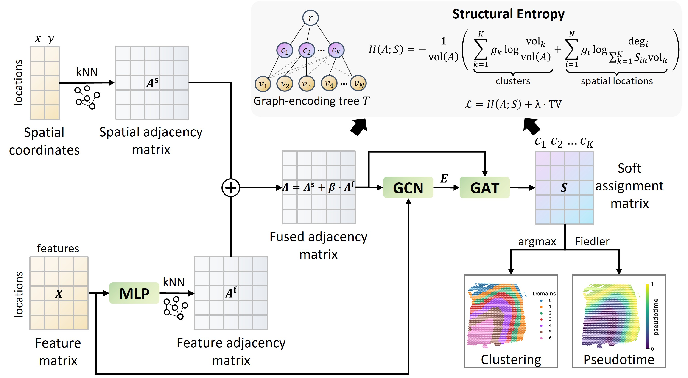

# SECTOR: Structural Entropy-based Learning of Spatiotemporal Organisation in Spatial Transcriptomics

<p align="center">
    
</p>

SECTOR (**S**tructural **E**ntropy-based **C**lustering and pseudo**T**ime **OR**dering) is a lightweight deep graph learning framework for spatial transcriptomics (ST). SECTOR jointly infers spatial domains and a continuous within-section pseudotime from the same model. It builds a fused spatial–expression graph from coordinates and gene expression of spatial locations (spots/cells/bins), then optimises a differentiable structural entropy objective regularised by spatial total variation (TV) to obtain spatially coherent domains and smooth pseudotime fields.

SECTOR has been evaluated across seven ST datasets grouped into three data regimes:

1. **Sequencing-based ST**: 10x Visium DLPFC and Stereo-seq mouse embryo.
2. **Imaging-based ST**: MERFISH hypothalamus, STARmap cortex and BaristaSeq primary cortex.
3. **Large-scale high-resolution ST**: Visium HD colorectal cancer (CRC) and Xenium breast infiltrating ductal carcinoma (IDC).

The recommended way to run SECTOR is through the **Python API**, as demonstrated in the tutorial notebooks. A command-line interface is also provided as a secondary convenience interface.

---

## 1. Clone the repository

```bash
git clone https://github.com/LHBCB/SECTOR.git
cd SECTOR
```

---

## 2. Installation

SECTOR has been developed and evaluated with `Python 3.12`, `PyTorch 2.7.1` with `CUDA 12.6`, and `torch_geometric 2.7.0`. We recommend using a dedicated conda environment.

### 2.1 Create a conda environment

```bash
conda create -n sector_env python=3.12
conda activate sector_env
```

### 2.2 Install PyTorch

CUDA build, recommended:

```bash
pip install torch==2.7.1 --index-url https://download.pytorch.org/whl/cu126
```

For CPU-only installation or a different CUDA version, follow the official PyTorch installation instructions for your system.

### 2.3. Install SECTOR dependencies
From the repository root:
```bash
pip install -r requirements.txt
```
This installs, among others: 
- Core scientific libraries: `numpy`, `scipy`, `pandas`, `scikit-learn`, `matplotlib`, `scikit-misc`
- ST / AnnData ecosystem: `anndata`, `scanpy`, `h5py`
- GNN stack (on top of installed PyTorch): `torch-geometric`
- Notebook support: `notebook`, `ipykernel`

---

## 3. Tutorial

### 3.1 Detailed tutorials

Three group-level tutorial notebooks are provided in this repository:

| Tutorial | Datasets covered | Main content |
|---|---|---|
| [`tutorial_sequencing_based_ST.ipynb`](tutorial_sequencing_based_ST.ipynb) | 10x Visium DLPFC; Stereo-seq mouse embryo | Sequencing-based ST workflow and parameter settings. |
| [`tutorial_imaging_based_ST.ipynb`](tutorial_imaging_based_ST.ipynb) | MERFISH hypothalamus; STARmap cortex; BaristaSeq primary cortex | Imaging-based ST workflow and parameter settings. |
| [`tutorial_large_scale_high_resolution_ST.ipynb`](tutorial_large_scale_high_resolution_ST.ipynb) | Visium HD CRC; Xenium IDC | Large-scale high-resolution ST workflow and parameter settings. |

Each notebook demonstrates:

- expected `.h5ad` input format;
- model initialisation through the Python API;
- key parameter settings for the corresponding dataset group;
- model fitting with `fit()`;
- domain and pseudotime inference with `pred()`;
- visualisation of spatial domains and pseudotime;
- metric reporting when annotations are available;
- practical tuning and troubleshooting guidance.

It is recommended to start from the tutorial notebook that best matches the technology and scale of the target dataset.

### 3.2 Expected input format

SECTOR expects each spatial section to be stored as an `.h5ad` / AnnData object. By default, both the Python API and CLI look for files at:

```bash
{dataset_path}/{dataset}/{slice}.h5ad
```

This path structure is convenient when a project contains multiple datasets or multiple slices per dataset. For example:

```bash
./data/10x_visium/151673.h5ad
```

For a custom dataset, create the same structure, for example:

```bash
./data/my_dataset/my_slice.h5ad
```

and set:

```python
dataset_path = "./data"
dataset = "my_dataset"
slice = "my_slice"
```

The input `.h5ad` file should contain:

| Field | Requirement |
|---|---|
| `adata.X` | Expression matrix with observations as rows and genes/features as columns. Raw or count-like expression values are recommended. Sparse matrices are supported. |
| `adata.obsm["spatial"]` | Spatial coordinates with shape `n_obs × 2`. |
| `adata.obs[label]` | Optional annotation column for evaluation only. The default label key is `Region`. |

If no annotation is available, run SECTOR with `eval_mode=0`. When `eval_mode=1`, SECTOR computes clustering metrics such as normalised mutual information (NMI), homogeneity (HOM) and completeness (COM) using the label column specified by `label`. Labels are not used during model training.

### 3.3 Basic usage example: 10x Visium DLPFC

```python
from sector import SECTOR

m = SECTOR(
    # input slice path
    dataset_path='./data',       # Root directory for ST datasets.
    dataset='10x_visium',        # Dataset folder name.
    slice='151673',              # DLPFC slice file name without the .h5ad suffix.

    # evaluation and output
    num_clusters=7,              # Expected number of spatial domains.
    eval_mode=1,                 # Evaluation mode; annotations are used only for metric calculation.
    label='Region',              # Ground-truth annotation column in adata.obs, required when eval_mode=1.

    # key graph and feature parameters
    n_comps=20,                  # Number of PCA components.
    n_top_genes=2000,            # Number of HVGs.
    k=1,                         # Feature-graph neighbours (k_feat in the manuscript).
    k_s=6,                       # Spatial-graph neighbours.
)

m.fit(
    lambda_tv=2.0,              # Spatial TV regularisation coefficient.
    lr=0.001,                   # Learning rate.
    stability_nmi_thr=0.97,     # Label-free early-stopping threshold based on assignment stability.
    balance_probe_epochs=20,    # Number of balance-probe epochs.
    gamma_balance=1.0,          # Balance regularisation weight, used only if the probe detects cluster under-use.
)

adata = m.pred(
    spatial_anchor='south',     # Pseudotime orientation; root_cluster can be used instead after inspecting domains.
    plot=True,                  # If True, spatial domains and pseudotime are plotted and saved.
    island_min_frac=0.1,        # Relative minimum component size for post hoc island cleaning.
    island_min_abs=40,          # Absolute minimum component size for post hoc island cleaning.
)
```

### 3.4 Outputs

By default, SECTOR saves outputs to:

```bash
./sector_model/{dataset}_{slice}_K{num_clusters}.pt
./output/{dataset}.{slice}.sector.h5ad
./figures/{dataset}.{slice}.clusters.png
./figures/{dataset}.{slice}.pseudotime.png
```

The output `.h5ad` file stores:

| Output | Location |
|---|---|
| Predicted spatial domains | `adata.obs["pred_region"]` |
| Inferred pseudotime | `adata.obs["pseudotime"]` |
| SECTOR embedding | `adata.obsm["sector_embedding"]` |
| Metrics, if `eval_mode=1` | `adata.uns["SECTOR"]["final_metrics"]` |

### 3.5 Optional: running SECTOR from the command-line interface

A CLI is available for users who prefer a one-command workflow. It calls the same SECTOR fitting and prediction logic as the Python API. For exploratory analysis and custom datasets, we recommend the Python API and notebooks over the CLI.

#### Example: 10x Visium DLPFC

```bash
python run_sector.py \
    --dataset_path ./data \
    --dataset DLPFC \
    --slice 151673 \
    --num_clusters 7 \
    --lambda_tv 2.0 \
    --eval_mode 1 \
    --plot True \
    --island_min_frac 0.1 \
    --island_min_abs 40
```

---

## 4. Key parameters and practical tuning guidance

The table below summarises the most important user-facing parameters. Defaults are sensible starting points, but some datasets may require limited tuning.

### 4.1 Data and evaluation

| Parameter | Default | Controls | Practical guidance |
|---|---:|---|---|
| `dataset_path` | `./data` | Root folder for datasets. | Use with `dataset` and `slice` to locate `{dataset_path}/{dataset}/{slice}.h5ad`. |
| `dataset` | `DLPFC` | Dataset folder name. | For custom data, use the folder name under `dataset_path`. |
| `slice` | `151673` | Slice/file name without `.h5ad`. | For custom data, use the `.h5ad` file stem. |
| `label` | `Region` | Annotation column in `adata.obs`. | Required only when `eval_mode=1`. |
| `eval_mode` | `1` | Whether to compute label-based metrics. | Use `0` for unannotated datasets. |

### 4.2 Graph construction and representation

| Parameter | Default | Controls | Practical guidance |
|---|---:|---|---|
| `num_clusters` | `7` | Expected number of spatial domains. | Set based on annotations, known anatomy, exploratory runs or the biological resolution of interest. Persistent under-use may indicate that this value is too large. |
| `lambda_tv` | `2.0` | Strength of spatial TV regularisation. | Increase for fragmented/noisy domains; decrease for oversmoothed domains or narrow adjacent regions. |
| `k_s` | `6` | Number of neighbours in the spatial graph. | Larger values increase spatial continuity; smaller values preserve fine boundaries. |
| `k` | `1` | Number of neighbours in the feature graph. | Larger values increase feature-graph connectivity but may over-aggregate weak signals. |
| `n_top_genes` | `2000` | Number of HVGs used before PCA. | Important for large-panel or whole-transcriptome datasets. Targeted-panel datasets often retain most or all informative genes. |
| `n_comps` | `20` | Number of PCA dimensions. | Moderate values usually work well. Increase if feature variation is not captured; reduce to lower memory cost. |
| `use_svg` | `False` | Use spatially variable genes instead of HVGs. | Experimental option. HVG-based feature construction is the default. |
| `beta_f` | `0.5` | Weight of feature graph in the fused graph. | Higher values emphasise expression similarity; lower values emphasise spatial adjacency. |

### 4.3 Optimisation and stability

| Parameter | Default | Controls | Practical guidance |
|---|---:|---|---|
| `lr` | `1e-3` | Learning rate. | Reduce for unstable training, especially on large or heterogeneous datasets. |
| `epochs` | `1000` | Maximum number of training epochs. | Increase if convergence is slow. |
| `tv_warmup_epochs` | `100` | Warm-up period for TV regularisation. | Helps avoid imposing spatial smoothing too early. |
| `unsup_patience_checks` | `6` | Label-free early stopping patience. | Increase for noisy or large datasets. |
| `stability_nmi_thr` | automatic | Stability threshold between consecutive assignments. | If omitted, SECTOR adapts this threshold by dataset size. |

### 4.4 Balance probe and cluster under-use

| Parameter | Default | Controls | Practical guidance |
|---|---:|---|---|
| `balance_probe_epochs` | `20` | Probe period with balance term disabled. | Keep enabled. SECTOR first tests whether all clusters are naturally used. |
| `gamma_balance` | `1.0` | Strength of optional balance regularisation. | Treat as a safeguard against severe cluster under-use, not a routine tuning knob. Increase only if under-use persists. |
| `balance_mode` | `volume` | Cluster-usage definition for the balance term. | `volume` is generally used for sequencing-based ST; `node` can be useful for cell-level imaging-based ST. |

If the balance probe succeeds, keep the balance term disabled. If it fails, start from the built-in default and tune only when necessary.

### 4.5 Pseudotime orientation and post-processing

| Parameter | Default | Controls | Practical guidance |
|---|---:|---|---|
| `root_cluster` | `None` | Cluster used to orient pseudotime. | Set when a biologically meaningful start domain is known. |
| `spatial_anchor` | `south` | Spatial anchor for pseudotime orientation when `root_cluster` is not set. | Choose from `north`, `south`, `east`, `west` according to tissue orientation. |
| `invert_y` | `True` | Whether to invert y-axis for plotting. | Adjust according to coordinate convention. |
| `island_min_frac` | `0.0` | Relative threshold for post hoc island cleaning. | Increase modestly for fragmented domains; reduce if small real regions are removed. |
| `island_min_abs` | `0` | Absolute minimum island size. | Use dataset-specific values, for example `40` in DLPFC tutorial settings. |
| `island_max_iter` | `2` | Maximum island-cleaning passes. | Usually does not require tuning. |

### 4.6 Large-scale mode

| Parameter | Default | Controls | Practical guidance |
|---|---:|---|---|
| `large_scale_mode` | `auto` | Dense/sparse implementation switching. | Keep as `auto` for most users. |
| `large_scale_n_obs_threshold` | `100000` | Threshold for very-large sparse mode. | Lower this value if memory is limited; raise it if hardware allows a more adaptive feature graph. |
| `use_hvg_only` | `1` | Whether large-scale mode keeps HVGs only. | Use `1` for whole-transcriptome data unless all genes are needed. |
| `attr_graph_mode` | `cached_exact` | Feature-graph builder in large-scale mode. | Default is recommended. |

In `large_scale_mode="auto"`, SECTOR uses:

- dense mode for `n_obs < 10,000`;
- sparse graph construction with an MLP-derived feature graph for `10,000 <= n_obs < large_scale_n_obs_threshold`;
- sparse graph construction with a PCA/raw feature graph for `n_obs >= large_scale_n_obs_threshold`.

This preserves the same SECTOR objective but avoids dense `N × N` distance or adjacency matrices for large datasets.

---

## 5. Diagnostics on common failure modes

SECTOR is usually robust across moderate parameter ranges, but different platforms and tissues may require limited tuning.

### 5.1 Oversmoothed domains

**Typical pattern:** neighbouring anatomical regions are merged, narrow boundaries disappear, or small biologically meaningful domains are absorbed into larger regions.

Possible adjustments:

- Decrease `lambda_tv` to reduce spatial smoothing.
- Reduce spatial or feature-graph connectivity by decreasing `k_s` and/or `k`.
- Reduce post hoc island-cleaning strength by decreasing `island_min_frac` and/or `island_min_abs`.

### 5.2 Fragmented or noisy domains

**Typical pattern:** predicted domains contain many isolated islands, boundaries appear noisy, or spatially coherent tissue regions are split into many small pieces.

Possible adjustments:

- Increase `lambda_tv` to encourage stronger spatial coherence.
- Increase spatial or feature-graph connectivity by increasing `k_s` and/or `k`.
- Apply modest island cleaning by slightly increasing `island_min_frac` and/or `island_min_abs`.

### 5.3 Under-used clusters

**Typical pattern:** the number of predicted clusters is smaller than `num_clusters`, or one or more clusters contain very few spots/cells/bins.

Possible adjustments:

- Keep the balance probe enabled so SECTOR can first test whether all clusters are naturally used.
- Increase `gamma_balance` only if cluster under-use persists after the balance probe.
- Reconsider whether `num_clusters` is biologically reasonable; persistent under-use may indicate that the requested number of clusters is larger than the tissue structure supports.
- For large-scale datasets, also consider tuning `lr`, because unstable optimisation can contribute to poor cluster usage.

### 5.4 Unstable training or poor convergence

**Typical pattern:** results vary substantially across runs, cluster usage changes abruptly, or training does not stabilise.

Possible adjustments:

- Reduce `lr`, especially for large or highly heterogeneous datasets.
- Increase `epochs` if the model has not converged.
- Check whether early stopping is too aggressive for the dataset.
- Keep the random seed fixed when comparing parameter settings.

### 5.5 High memory usage

**Typical pattern:** training is slow, memory is exhausted, or graph construction becomes the bottleneck.

Possible adjustments:

- Keep `large_scale_mode="auto"`; SECTOR automatically switches from dense to sparse graph construction for larger datasets.
- For very large datasets, SECTOR further reduces memory usage by constructing the feature graph from the PCA representation rather than repeatedly updating it from a changing neural representation.
- Adjust `large_scale_n_obs_threshold` depending on available hardware. The default is `100000`.
- For whole-transcriptome or large-panel datasets, reduce `n_top_genes` and/or `n_comps`.
- Reducing `k_s` and/or `k` can also reduce graph size, but may affect spatial continuity and should be tuned together with `lambda_tv`.

---
